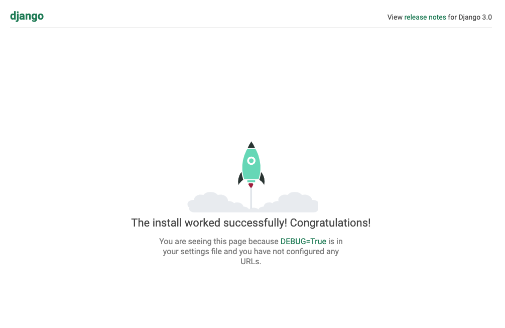

# django-boilerplate
[](https://travis-ci.org/ritwickdsouza/django-boilerplate)

## Features
* Django 3.0.5
* Python 3.8.2
* Gunicorn 20.0.4
* Nginx 1.17.10
* PostgreSQL 12.2
## Usage
###  Development usage
1. To run the project locally using docker
    ```bash
    docker-compose up -d --build
    ```
2. Open http://localhost:8000/ in your browser. You should see the following page.
    
